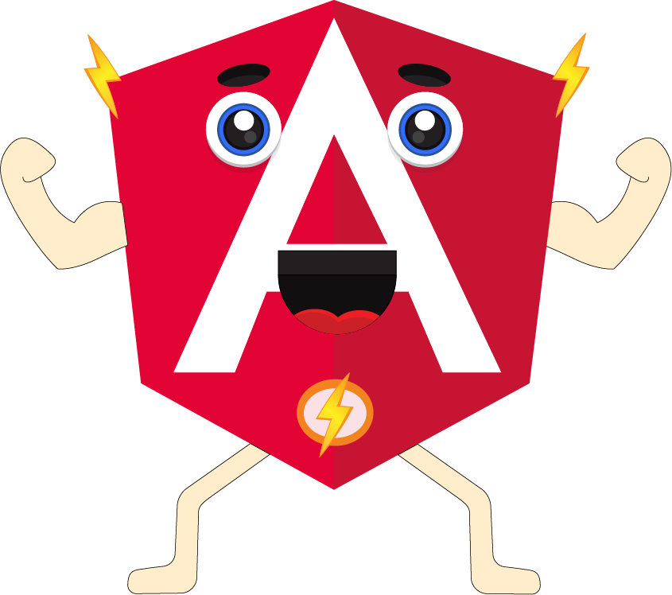

# 🧐 Conceptos Básicos en Angular 🧐



Angular es un framework que esta compuesto de componentes, entre la estructura que encontramos de Angular cuando creamos un proyecto de Angular usando el @angular-cli \(cliente de Angular para generar las aplicaciones\), o un editor online sea stackblitz o sandbox; es que Angular tiene un archivo module.ts, que es como un contenedor donde se importan y se incluyen dependencias \(aquellos archivos que necesita para su ejecución\), ademas de importar componentes, servicios, entre otros.

## 🏺 Módulos 🏺

Los módulos como mencione son contenedores, en se hace referencia a los componentes, a otros módulos que pueden contener otros componentes, a los servicios y otros archivos que necesitemos para la construcción de diferentes elementos de Angular o uso de otras librerías. Se encuentra normalmenteel archivo como. 'nombrearchivo.module.ts'.

La estructura del module es como la siguiente:

```typescript
@NgModule({
  declarations: [AppComponent],
  imports: [BrowserModule, AppRoutingModule],
  providers: [],
  bootstrap: [AppComponent]
})
export class AppModule {}
```

## 📦 Componente 📦

Los componentes de Angular son donde vamos a estructurar nuestra aplicación. Cuando construmos una aplicación analizamos cual va a ser le contenedor de la página, y que elementos internamente vamos a separar el componentes que nos van a ayudar con la lógica de negocio de la página o solo a mostrar un componente visual \(sea solo un boton, o un menu, un header, etc.\)


Un componente en Angular es un elemento que está compuesto por:

* Un archivo que será nuestro Template \(app.component.html\), el cual es nuestro HTML, que es el que se va a visualizar en la interfaz de usuario, la vista o en términos más simples lo que vas a ver en la página.
* Un archivo de lógica, la cual es la que pondremos en un archivo .ts \(como por ejemplo app.component.ts\), ese archivo debe incluir una clase y esta es la que va a contener las propiedades que se van a usar en la vista \(HTML\) y los métodos que será las acciones que se ejecutarán en la vista. En este archivo de lógica también se incluye una metadata, que es definida con un decorador, que identifica a Angular como un componente.
* Un archivo para el CSS \(podemos usar un preprocesador como SASS o LESS\), donde incluiremos los estilos, lo que nos ayuda a hacer bonita nuestra aplicación.


La estructura de un componente es así:

```typescript
import { Component } from '@angular/core';

@Component({
  selector: 'my-app',
  templateUrl: './app.component.html',
  styles: []
})
export class AppComponent {}
```

Adicional a los archivos que mencione, CSS, HTML que son los principales en nuestro componente, e incluso podrían no estar, ya que podemos colocar nuestro HTML usando el selector 'template' y el CSS, el selector styles. Podemos ir añadiendo más archivos de acuerdo a la necesidad que tengamos en nuestro proyecto.

Como por ejemplo:

* Un archivo para el test, donde podemos incluir nuestras pruebas unitarias.

Y podemos incluir muchos archivos más.

Cuando creamos un componente o estamos usando el base de app, para incluir nuestro componente en otros componentes debemos usar la propiedad 'selector' que se encuentra en el decorador, en otro html asi:

```markup
<my-app></my-app>
```

Puedes ampliar la informacion de los componentes en el siguiente link: [componentes](https://medium.com/@vanessamarely/componentes-en-angular-f25138b00c83).

## 🧑‍🎨 Directivas 🧑‍🎨

Las Directivas extienden la funcionalidad del HTML usando para ello una nueva sintaxis. Con ella podemos usar lógica que será ejecutada en el DOM \(Document Object Model\).

Cada Directiva que usamos tiene un nombre, y determina donde puede ser usada, sea en un elemento, atributo, componente o clase.

Se dividen en tres tipos diferentes:

* Directivas de Atributo: Alteran la apariencia o comportamiento de un elemento del DOM. Son usados como atributos de los elementos.
* Directivas de estructurales: Nos permite añadir, manipular o eliminar  elementos del DOM.
* Componentes: Las Directivas de Componente son directivas con un Template.

Para ampliar un poco más la información de Directivas y como usarla, puedes leer este artículo: [Directivas](https://medium.com/@vanessamarely/directivas-en-angular-efb8a8cf78e0)

## Data Binding

Se le llama Data Binding o enlace de Datos, a la técnica que nos sirve de puente de comunicación entre una vista HTML y una fuente de datos, nuestro modelo; y los sincroniza, permitiendonos una actualización casi que en tiempo real de nuestra data a nuestra vista.

Tipos Binding de datos

* One Way \(una sola vía\) . Los cambios solo se reflejan en la vista o modelo, pero no hay sincronia enre ambos frente a una actualización de la data.
* Two Way \(dos vias\). Se usa generalmente en los formularios, ya que se desea que el usuario ingrese la información, esta se actualice correctamente.


