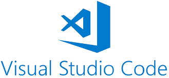
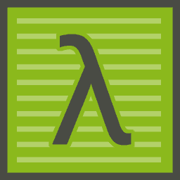
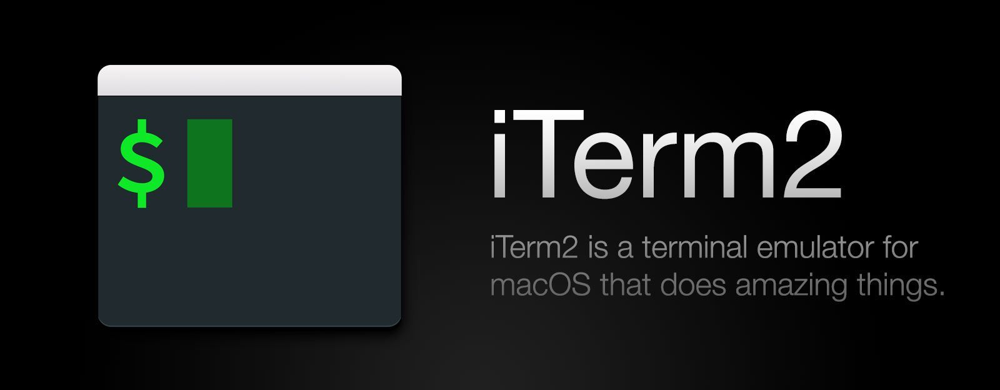

# ⚙️ Herramientas ⚙️

En el desarrollo de software existen una cantidad de herramientas que nos permiten crear código, mantener, almacenarlo por versiones, y nos permiten empaquetarlo.

En esta sección detallaremos las herramientas que vamos a usar para crear nuestras aplicaciones online o localmente en nuestras máquinas.

## Editores de código o texto

Un editor de código o de texto, es un programa que nos permite en el crear nuestras lineas de código. Un bloc de notas nos puede servir como un editor de texto, aunque existen programas más especializados que dependiendo del lenguaje nos mostrará nuestro código por colores, incluso podrá mostrarnos nuestros errores al ejecutar incorrectamente alguna palabra clave de nuestro lenguaje.

Y estos más especializados los llamamos IDE  \(Integrated Development Environment\) o **Entorno de Desarrollo Integrado**. Los IDE tienen un editor de texto, ademas tienen algunas funciones avanzadas como autocompletar el código, se puede integrar con sistemas de control de versiones, algunos pueden simular dispositivos y pueden gestionar la conección con la base de datos.

Usaremos de manera online: **Stackblitz** y **Codepen**, te recomiendo registrarte en ambas páginas, para que puedas tener la colecciones de tus aplicaciones o páginas Web y puedas acceder a ellas en cualquier momento.

\*\*\*\*[**Stackblitz**](https://stackblitz.com/) es un IDE en la nube que te permite crear aplicaciones Web. Eso quiere decir que ¡no tienes que instalar nada para crear tu aplicación! 😎

Podemos seguir esta guia para aprender como usar stackblitz. [https://ngchallenges.gitbook.io/project/guias-utiles/stackblitz](https://ngchallenges.gitbook.io/project/guias-utiles/stackblitz)

[**Codepen** ](https://codepen.io/)es una herramienta de **prototipado rápido y prueba de fragmentos de código**. Solo necesitas acceder a la url de codepen y tendrás un espacio, donde podrás incluir tus líneas de HTML, CSS y JS.

De manera local en nuestras máquinas usaremos [Visual Studio Code](https://code.visualstudio.com/), te recomiendo descargarlo e instalarlo en tu computadora de acuerdo a tu sistema operativo.

## Manejador de versiones

Para que no tengamos la necesidad de por cada cambio que hagamos en nuestro código y tener ese paso a paso, guardado en algun lugar, evitandonos creando multiples carpetas por versiones como lo haciamos cuando creabamos documentos en sus multiples versiones, existen unas aplicaciones que nos ayudan a manejar el versionamiento, y la que usaremos será [Github](https://github.com/). 

Podemos seguir la siguiente guia para crear nuestra cuenta en github: [https://ngchallenges.gitbook.io/project/guias-utiles/github](https://ngchallenges.gitbook.io/project/guias-utiles/github)

## Otras Herramientas

Para hacer la instalación de Angular, de manera loca en nuestras computadoras, necesitaremos tener instalado [**node.js**](https://nodejs.org/es/) \(es un entorno en tiempo de ejecución multiplataforma\) y un manejador de paquetes como ****[**npm** ](https://www.npmjs.com/)\(Node Package Manager o simplemente npm es un gestor de paquetes\). Te recomiendo instalarlos de acuerdo a tu sistema operativo.

Para ejcutar ciertos comandos es necesario hacer uso de la terminal. Para aquellos que tengan visual studio code, puede usar la terminar que esta tienen integrada, o en el cso de que tengas Windows, puedes usar [cmder](https://cmder.net/) y en el caso de MacOS, pueden usar terminal o [iterm](https://www.iterm2.com/). n el caso de linux, dependiendo del paquete de distribución existen muchas opciones \([Terminator](https://terminator-gtk3.readthedocs.io/en/latest/)\).

