# 🧠 ¿Qué es JavaScript? 🧠

## 🧠Introducción a JavaScript🧠

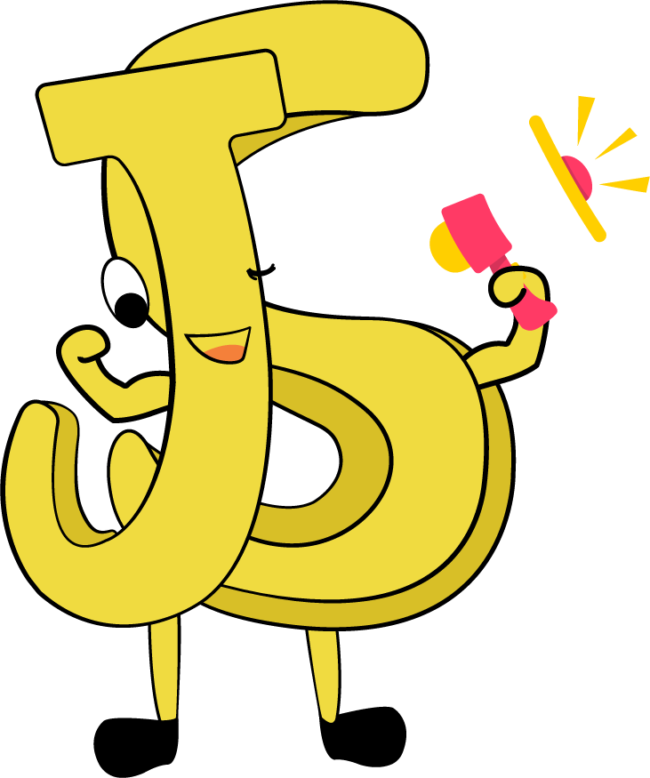

JavaScript es un lenguaje de programación, se dice de él que es multiparadigma y es débilmente tipado. Es multiplataforma, ya que se puede utilizar en Windows, Linux o Mac. Se puede usar en cualquier navegador. Se puede usar en ambientes de cara al usuario y del lado del servidor.

JavaScript permite la manipulación de cualquier elemento del documento \(DOM\) y tambien permite la manipulación de los estilos \(CSSOM\).

Es sencillo de aprender y en esta mini guía voy a contarte algunas caracteristicas sobre él.

### Historia de JavaScript

JavaScript es un lenguaje creado por Netscape, en sus inicios fue llamado LiveScript. En 1995 Netscape y Sun Microsystems crearon JavaScript. En 1997 el ECMA, organismo internacional creo la primera edición de la norma ECMAscript, que inicio a normalizar el lenguaje. Desde ese momento JavScript se convirtio en el lenguaje más usado.

### Insertar JS en el documento HTML

Hay dos formas de incluir nuestro código JavaScript en nuestro documento HTML.

* Insertar JavaScript en HTML utilizando la etiqueta:


* Agregar código JavaScript a un archivo separado


##  Variables

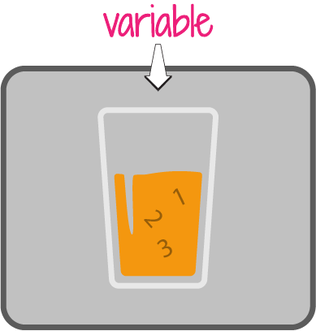

Una variable es un recurso de memoria reservado para alojar  información. Podemos declarar una variable mediante la palabra reservada «**var**» seguida del nombre de la variable.


Las palabras reservadas, son palabras que usa JavaScript las cuales tienen una función particular y nosotros no podemos sobreescribir, solo usarla para lo que fue creada.


Podemos almacenar cualquier tipo de dato en las variables.

```javascript
var nombreVariable;
var a;
var b;
```

Desde la versión del ECMA2015, es posible crear nuestras variables usando la palabra reservada "const" y "let".  
****

«**let**» ****permite hacer la reasignación de variables.


```javascript
let nombreVariable = 'texto';
let a = 'abc';
a = 123;
let b = 1;
b = 5;
```

 ****«**const**» ****es una constante y no permite la reasignación de los valores a las variables.

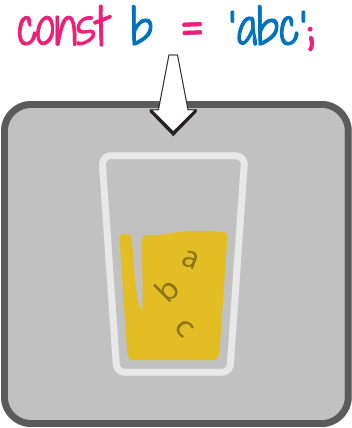

```javascript
const nombreVariable = 'texto';
const a = 'Hola Mundo';
const b = 'abc';
const c = 123;
```

## Tipos de Datos

Los tipos de datos en JavaScript se dividen en dos grupos **primitivos** y **objetos**.

**Primitivos:** los tipos de datos primitivos no tienen propiedades y métodos, y podemos encontrar los siguientes tipos de datos:

* Boolean: Es un tipo de dato lógico, puede tener un valor "**true**" o "**false**"
* Null: Es un tipo de dato nulo.
* Undefined: Es una variable a la que no se le ha asignado ningun valor.
* Number: Es tipo de dato númerico
* BigInt: Es tipo que sirve para representar números grandes.
* String: Es una cadena de texto.
* Symbol: Es utilizado como claves en objetos y mapas de datos. Cuando creamos un simbolo, obtenemos un valor único.

**Objetos:** Es un tipo de dato que puede ser llamado colección de propiedades y tiene propiedades y métodos.

```javascript
let message = 'hello';
message = 123456;
let isChecked = true;
let age = null;
let x; //undefined 
```

### typeof

**typeof** es un operador que permite identificar el tipo de dato de las variables.

```javascript
typeof undefined                    // undefined
typeof true                         // boolean
typeof 42                           // number
typeof "42"                         // string
typeof { name: 'Vane' }             // object
```

## Operadores

Los operadores permiten manipular las variables, realizar operaciones matemáticas, comparaciones lógicas o asignaciones.

Existen varios tipos de Operadores.

### Operador de Asignación

Este operador nos permite asignar un valor a nuestras variables, como por ejemplo:

```javascript
const variableA = 5;
let variableB = 'Hola';
variableB = 10;
```

### Operador de Incremento y Decremento

Este operador permite incrementar o decrementar en una unidad el valor de la variable.

```javascript
//incremento
let contador = 0;
contador++;
console.log(contador)                // 2

//decremento
let contador = 5;
contador--;
console.log(contador)                // 4
```


Para mostrar el resultado de una variable o una sentencia o expresión, podemos usar una función que tiene JavaScript que se llama "**console**", en este caso estamos usando la propiedad "**log**". Esta función nos mostrará en la consola del navegador el resultado de lo que incluyamos en los paréntesis.


### Operadores lógicos

Nos permite tomar decisiones sobre las instrucciones, incluso nos permite negar una instrucción.

#### Negación \( ! \)

```javascript
const isVisible = true;
console.log(!isVisible)                // false
```

#### AND \( && \)

Para usar este operador se tiene en cuenta la tabla de verdad.

```javascript
const valor1 = true;
const valor2 = false;
console.log(valor1 && valor2)            // false
```

#### OR \( \|\| \)

Para usar este operador se tiene en cuenta la tabla de verdad.

```javascript
const valor1 = true;
const valor2 = false;
console.log(valor1 || valor2)            // true
```

### Operadores Relacionales

Estos operadores son los que usamos para evaluar expresiones; en ellos podemos usar el mayor que \(&gt;\), menor que \(&lt;\), mayor o igual \(&gt;=\), menor o igual \(&lt;=\), igual que \(==\) diferente de \(!=\), estrictamente igual \(===\), y estrictamente diferente \(!==\).

```javascript
const numero1 = 3;
const numero2 = 5;
let resultado;
resultado = numero1 > numero2;
resultado = numero1 < numero2;
resultado = numero1 >= numero2;
resultado = numero1 <= numero2;
```

### Operadores de igualdad

En JavaScript hay dos tipos de operadores de igualdad: estricta y no-estricta. En la estricta es aquella en la que se evalua la expresión que sea igual o diferente, el tipo y el valor, en esta se usan los triples iguales: '**===**' o diferente y dobles iguales: '**!==**'; y en la no-estricta se evalua solo el valor, y se usan los dobles iguales: '**==**' o el diferente: '**!=**'.

```javascript
console.log( 0 == 0);                                // true
console.log( "" == 0 );                              // true
console.log( false == 0);                            // true
console.log( undefined != 0);                        // true
console.log( null == 0);                             // false

console.log('1' === 1);                              // false
console.log(2 === 2);                                // true
console.log('abc' !== 123);                          // true
```

### Operadores Aritmeticos

Estos operadores nos permiten realizar operaciones artimeticas, evaluan la expresión y devuelven un único resultado.

```javascript
const numero1 = 10;
const numero2 = 5;
let resultado = numero1 / numero2;                            // resultado es 2
resultado = 3 + numero1;                                      // resultado es 13
resultado = numero2 - 4;                                      // resultado es 1
resultado = numero1 * numero2;                                // resultado es 50
```


### Orden de prioridad, prelación y precedencia.

Los operadores lógicos, de igualdad y matemáticos tienen un orden de prioridad, prelación o precedencia al evaluar las expresiones o realizar las diferentes operaciones.

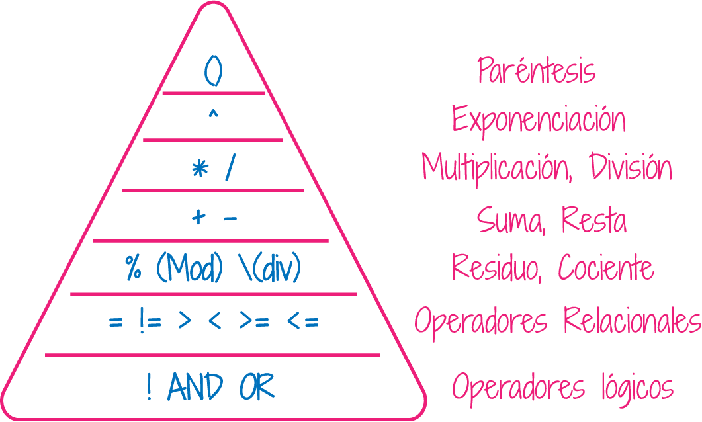

```javascript
let resultado = 3 + 4 * 5;                                 // 23
console.log(4 * 3 ** 2);                                   // 36
// 4*(3 ** 2) => 4 * (9) => 36
3 > 2 && 2 > 1                                             // true
3 > 2 > 1                                                  // false                              
```

## Estructuras de control de Flujo

Las estructuras de control de flujo, son intrucciones que nos permiten evaluar si se puede cumplir una condición o no, incluso nos puede ayudar a evaluarla n cantidad de veces.

### Condicionales

Los condicionales nos permiten evaluar si una condición cumple o no con lo que estemos evaluando. Su sintaxis es muy sencilla, podemos evaluar si la condición es verdadera o falsa. Incluso añadir una condición intermedia en el caso de que no se cumpla la primera condición y se deban evaluar más.

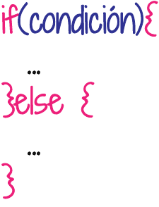

```javascript
const mayorEdad = 18;
if(mayorEdad >= 18) {
    console.log("Es mayor de edad");
}else {
    console.log("Es menor de edad");
}
```

```javascript
const mayorEdad = 18;
if(mayorEdad >= 18) {
    console.log("Es mayor de edad");
else if(mayorEdad > 18 && mayorEdad < 25) {
    console.log("Es un adulto joven");
}else {
    console.log("Es menor de edad");
}
```

### Ciclos, Bucles o Loops

Se le pueden llamar, ciclos, bucles o loops, en ellos se evalua una condición n veces hasat que esta se cumpla. En estos podemos encontrar los for, while, entre otros.

#### for

Un bucle for se repite como mencione hasta que la condición que se esta evaluando se cumpla.


```javascript
const pasos = 5;
for(let paso = 0; paso <= pasos; paso++){
    console.log("Estoy dando el siguiente paso: " + paso);
}
```

#### while

Ejecuta una sentencia mientras la condición que este evaluando sea verdadera.

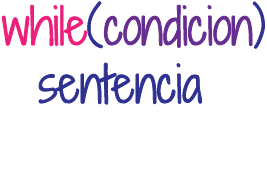

```javascript
const contador = 0;
while(contador < 3) {
    contador++;
}
console.log("Contador es igual a: ", contador);
```

### Switch

Permite evaluar una expresión e intenta igual el valor de esa expresión a una etiqueta llamada case, que es el caso a evaluar. En el caso de que la condición se cumpla o lo que tiene el case, se ejecuta la sentencia que este en ese caso.


```javascript
switch(tipoFruta) {
    case "Naranjas":
        console.log("Las Naranjas cuestan $5");
        break;
    case "Manzanas":
        console.log("Las Manzanas cuestan $10");
        break;
    case "Fresas":
        console.log("Las Fresas cuestan $15");
        break;
    default
        console.log("Disculpa, no tenemos ese tipo de fruta: ", tipoFruta);
        break;
}
```


En el switch se usa una sentencia llamada "**break**", esta nos permite salir de la condición que se esta evaluando.


## Funciones

Las funciones son pequeñas recetas que nos permiten reutilizar operaciones, sentencias de una forma mucho más legible y nos permite reutilizar el código que hayamos hecho.

Existen dos tipos principales de funciones: las funciones llamadas **declaradas** y las funciones **expresadas**.

### Declaradas o Declarativas

Las funciones declaradas inician con la palabra reservada function, seguido del nombre de la función, una lista de **parámetros** que puede ser opcional y ván entre parentesis, seguida de unas llaves donde van a ir nuestras sentencias.  Las funciones se declaran pero para poder usarlas, se deben hacer el llamado de ellas. Cuando creamos una función pasandole los **parámetros** entre los parentesis, al llamar la función debemos incluirle los **argumentos**. 


```javascript
function saludo(){
    console.log("Hola mundo!!");
}
saludo(); // -> llamamos a la función
// el resultado será -> Hola mundo! 
```

```javascript
function sumar(numero1, numero2){
    console.log(numero1 + numero2);
}
sumar(8, 9); // -> llamamos a la función y le pasamos los argumentos
// el resultado será -> 17
```


Habras notado que cuando se crea una función podemos pasarle **parámetros**, asi se llaman a estos valores cuando creamos la función; pero al invocar o llamar la función los valores que le pasamos a esta función se llaman **argumentos**.


### Expresadas

La estructura de estas funciones es similar a la anterior, pero no inician con la palabra reservada function y no es obligatorio que tengan nombre. Esta función se puede almacenar en una variable o constante.


```javascript
const saludo = function(){
    console.log("Hola mundo!!");
}
saludo(); // -> llamamos a la función
// el resultado será -> Hola mundo! 
```

```javascript
const sumar = function(numero1, numero2){
    console.log(numero1 + numero2);
}
sumar(8, 9); // -> llamamos a la función y le pasamos los argumentos
// el resultado será -> 17
```

### Arrow function

Apartir del estandar ES6, se introdujo esta nueva forma de crear las funciones. Esta es solo una forma abreviada de crear una función. Estas son anónimas, no poseen un nombre de función.

Para crearlas podemos definir una lista de parámetros , pueden tenerles o no; seguido del flat arrow o flecha y en el caso de que sea solo una sentencia o instrucción que se va a realizar o ejecutar, se pueden omitir las {}, sin tienen varias sentencias se deben incluir las {}.

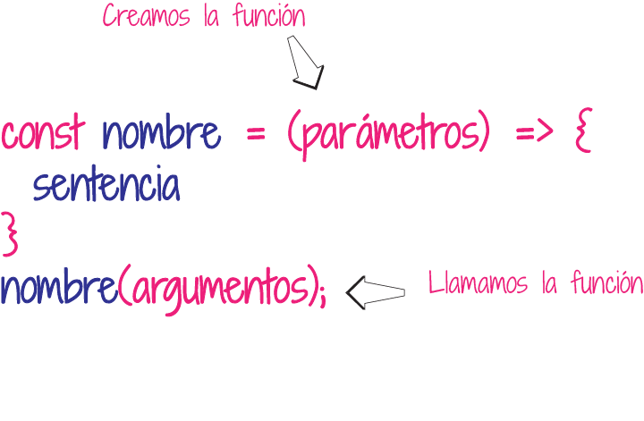

```javascript
const saludo = () => console.log("Hola mundo!");
saludo(); // -> llamamos a la función
// el resultado será -> Hola mundo! 
```

```javascript
const sumar = (numero1, numero2) => {
    console.log("-- El resultado es: --");
    console.log(numero1 + numero2);
}
sumar(8, 9); // -> llamamos a la función y le pasamos los argumentos
// -- El resultado es: --
// 17
```

## Array

Los arrays son listas o colecciones de datos. Los arrays son del tipo de datos de objetos, y nos permiten almacenar cualquier tipo de dato. Cada dato se llama elemento y se le asigna un indice, que sirve para identificarlo. Los arrays inician desde el indice o posición 0.

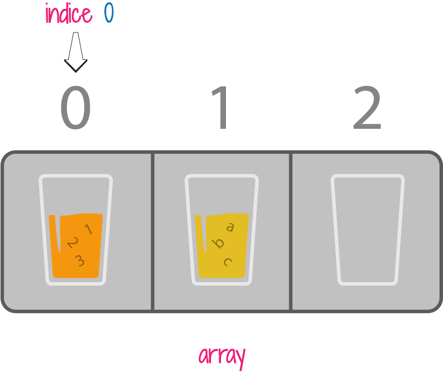

Creamos un array de dos formas:

* Haciendo uso de los corchetes. En los corchetos podemos especificar los datos que va a tener nuestro array o declararlo vacío.

```javascript
const arrayVacio = [];                        // creamos un array vacío
const frutas = ['Manzanas', 'Naranjas', 'Fresas'];            
const listaNumeros = [1, 2, 3];
const arrayElementos = [1, 'abc', null];
```

* Haciendo uso de la palabra reservada newArray\(\). En los paréntesis podemos asignarle los datos que va a tener nuestro array o declararlo vacío.

```javascript
const arrayVacio = new Array();                    // creamos un array vacío
const frutas = new Array('Manzanas', 'Naranjas', 'Fresas');  
const listaNumeros = new Array(1, 2, 3);
const arrayElementos = new Array(1, 'abc', null);
```

Para obtener los datos del array, podemos hacer referencia a su indice si deseamos obtener la data de una posicion especifica, así:

```javascript
const frutas = ['Manzanas', 'Naranjas', 'Fresas'];  
console.log('las frutas son: ', frutas[1]);
//las frutas son: Naranjas
```

Es posible hacer operaciones con los arrays, para ordenarlos, filtrar sus resultados, para añadir un elemento al inicio, al final, en una posición determinada, entre otras operaciones.

## Objetos

Los objetos son colecciones de propiedades. Una propiedad se reconoce porque tiene un nombre \(o clave\), que será igual a un valor. Un apropiedad puede ser como lo mencione tener un nombre y un valor o ser una propiedad de tipo función, donde podemos ejecutar sentencias o instrucciones.

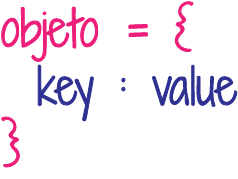

Hay dos tipos de Objetos: Objeto **literal** o declarativo y el **constructor**.

### Objeto literal o declarativo

Este objeto se crea usando las llaves {} y dentro de ellas, podeos incluir una lista de propiedades con sus respectivos valores asociados.

La clave \(key\) o nombre de la propiedad, puede tener un valor que puede ser de cualquier tipo de dato.

Los objetos se pueden crear a una constante se le asignan unas llaves, donde se crearia un objeto vacio, o se le asigna a la constante un objeto con las propiedades. Para crear un objeto vacio tambien se puede hacer mediante la palabra reservada new Object\(\)

```javascript
const usuario1 = new Object();             // creamos un objeto vacío
const usuario2 = {};                       // creamos un objeto vacío
const usuario3 = {                         // creamos un objeto con propiedades
    nombre: 'Usuario',
    edad: 25
};
```

Para obtener los valores de un objeto, podemos hacerlo colocando el nombre del objeto seguido de un punto \(.\)y luego la propiedad, o podemos al nombre del objeto, colocarle luego de este entre corchetes el nombre de la propiedad.

```javascript
const usuario3 = {                         // creamos un objeto con propiedades
    nombre: 'Usuario',
    edad: 25
};
console.log('El nombre de usuario es: ', usuario3.nombre);
console.log('La edad del usuario es: ', usuario3['edad']);
```

Para incluir una nueva propiedad podemos al nombre del objeto seguido del punto colocarle la nueva propiedad y hacerla igual al valor.

```javascript
const usuario3 = {                         // creamos un objeto con propiedades
    nombre: 'Usuario',
    edad: 25
};
usuario3.lugarNacimiento = 'Medellin';
```

Para eliminar una propiedad podemos hacer uso de una palabra reservada que se llama "**delete"**, que permite borrar las propiedades de los objetos. 

```javascript
delete.usuario3.edad;
//borra la propiedad edad
```

### Objeto Constructor

Para estos objetos se usa una función llamada constructora, en esta el nombre de la función será el nombre del objeto y se le colocará este nombre usando la primera letra en mayuscula inicial, para hacer uso de esta función se deberá instancia el objeto usando la palabra reservada **new** \(u operador\).

Dentro de la función constructura se hace uso de la palabra reservada **this**, la cual va  ahacer referencia al objeto. 

```javascript
function Usuario(nombre, edad){
    this.nombre = nombre;
    this.edad = edad;
}

const usuarioAna= new usuario('Ana', 40);
```

###  Prototipos

Los objetos de JavaScript provienen de Object y tienen en su interior un -_proto_- o prototype \(prototipo\), que nos permite heredar propiedades y métodos. Si necesitamos extender o sobreescribir el comportamiento de los objetos lo hacemos mediante prototype.

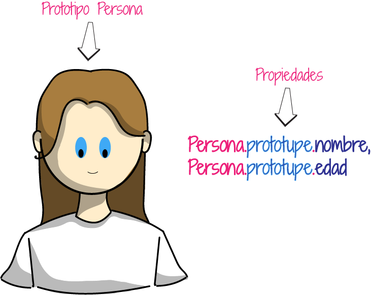

```javascript
function Persona(){
}

Persona.prototype.nombre = 'Ana';
Persona.prototype.edad = 33;
Persona.prototype.mostrarNombre = function(){
    console.log(this.nombre);
}

const persona1 = new Persona();
console.log(persona1.nombre);                    // Ana
```

### Clases \(Class\)

Las clases son conjunto de elementos con caracteristicas comunes. Una Clase como un objeto contiene propiedades y métodos.

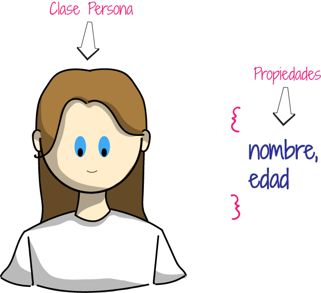


```javascript
class Persona {
    constructor(nombre){
        this.nombre = nombre;
    }
    
    hablar(){
        console.log(this.nombre + 'habla');
    }
}

const persona1 = new Persona('Ana');
```


Existen mucha información sobre JavaScript, funciones, tipos de datos, declaraciones, etc; que puedes ampliar en [mdn](https://developer.mozilla.org/es/docs/Web/JavaScript), que es una gran guía para consultar todas las dudas conceptuales que tengamos sobre este gran lenguaje de programación.


