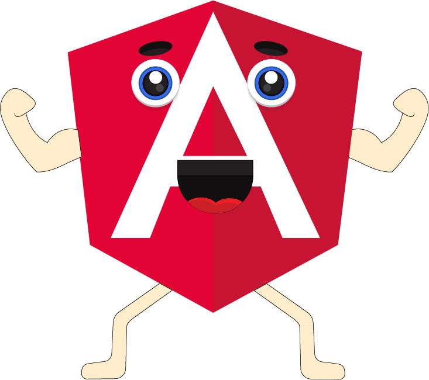

# 🅰️ ¿Qué es Angular? 🅰️

## 🅰️ Angular 🅰️

Angular es un Framework que permite crear aplicaciones Web. Puedes crear una SPA \(**Single Page Applications**\) o aplicación de una sola página. Fue creado por Google y usa TypeScript como lenguaje de programación.

## 🕰️ Historia 🕰️

Fue desarrollado en el 2009 por [**Miško Hevery**](https://github.com/mhevery), inicialmente se llamaba **AngularJS**, el cual estaba basado en JS; fue la primera versión de Angular y esta basado en el paradigma de programación orientada a objetos.

El 14 de septiembre del 2016 fue lanzado Angular 2, que conocemos en la actualidad como **Angular**, basado en Typescript, el cual fue es basado en el paradigma Modelo View lo que sea.

Actualmente Angular se encuentra en la versión 10 y cada 6 meses es lanzada una nueva versión.

## 📋 Características 📋

Angular es basado en componentes, los componentes son partes de la aplicación, que pueden tener una vista y se pueden reutilizar.

**Modularidad**: las funcionalidades se empaquetan en módulos, que sirve como un contenedor de componentes y donde especificamos las dependecias y librerías que incluimos en la aplicación 📦

**Compatibilidad**: compatible con los navegadores más modernos y recientes. 🆕

**Fácil de aprender**: el Framework es fácil de aprender, es sencillo hacer tu primera App en Angular solo debemos aprender un poco sobre la sintaxis de Angular y algunos conceptos y  crearemos nuestra App de forma sencilla. 

Tiene una buena documentación, aparte de la página oficial de angular [angular.io](http://angular.io/), muchos contribuyen en generar artículos para enriquecer su documentación.

Angular tiene una gran comunidad, que ayudan a dar a conocer el framework.

Se pueden crear las aplicaciones fácilmente y rápidamente usando el cliente de angular: angular-cli.

## 

